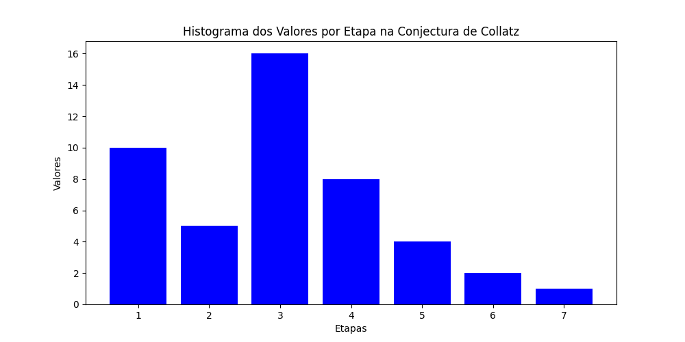
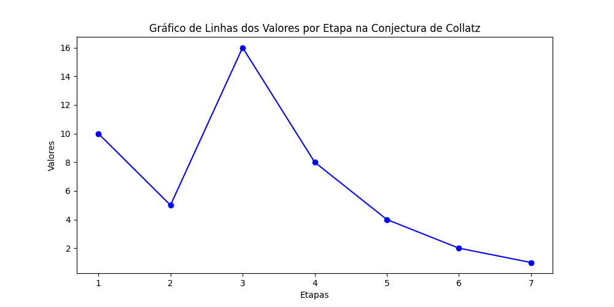
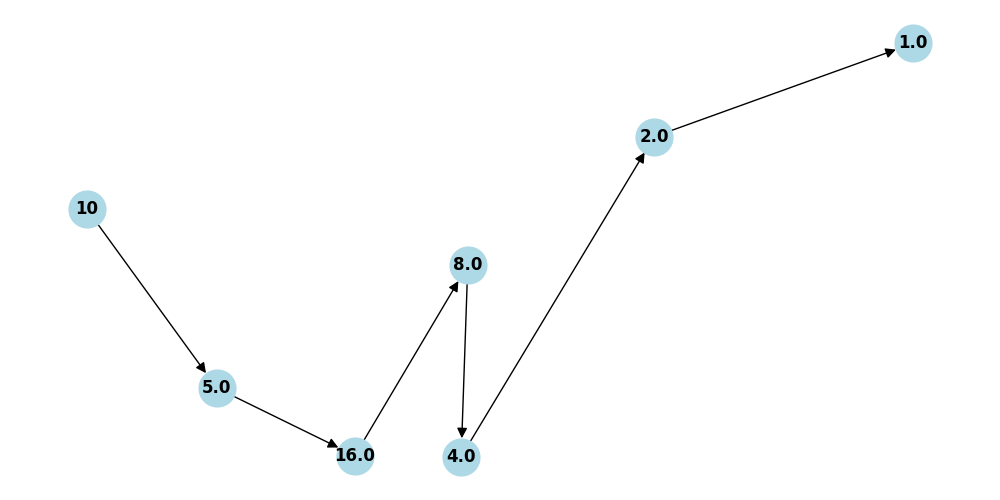

# Collatz Conjecture

Este repositório contém um script em Python para visualizar a Conjectura de Collatz utilizando gráficos de linha, histogramas e grafos direcionados. A Conjectura de Collatz é uma conjectura matemática que envolve uma sequência definida de números naturais. 

## Estrutura do Projeto

- **collatz_conjecture.py**: O script principal que implementa a lógica da Conjectura de Collatz e gera as visualizações gráficas.

## Dependências

Para executar o script, você precisará das seguintes bibliotecas Python:

- `matplotlib`
- `networkx`

Você pode instalar essas dependências usando o pip:

```sh
pip install matplotlib networkx
```

## Como Utilizar

1. Clone este repositório:

```sh
git clone https://github.com/seu_usuario/collatz-conjecture.git
cd collatz-conjecture
```

2. Execute o script:

```sh
python collatz_conjecture.py
```

3. Insira um número positivo diferente de 1 quando solicitado.

O script então calculará a sequência da Conjectura de Collatz para o número inserido e gerará três tipos de visualizações:

### Histograma dos Valores por Etapa



### Gráfico de Linhas dos Valores por Etapa



### Gráfico Direcionado da Conjectura de Collatz



## Funções Principais

- `collatz_conjecture(n)`: Calcula a sequência da Conjectura de Collatz para um número `n` e retorna o número de etapas e a sequência gerada.
- `plot_histogram(sequence)`: Gera um histograma dos valores da sequência por etapa.
- `plot_line_chart(sequence)`: Gera um gráfico de linha dos valores da sequência por etapa.
- `plot_directed_graph(sequence)`: Gera um grafo direcionado da sequência da Conjectura de Collatz.

## Exemplo de Uso

```python
n = 27
steps, sequence = collatz_conjecture(n)
plot_line_chart(sequence)
plot_histogram(sequence)
plot_directed_graph(sequence)
```
